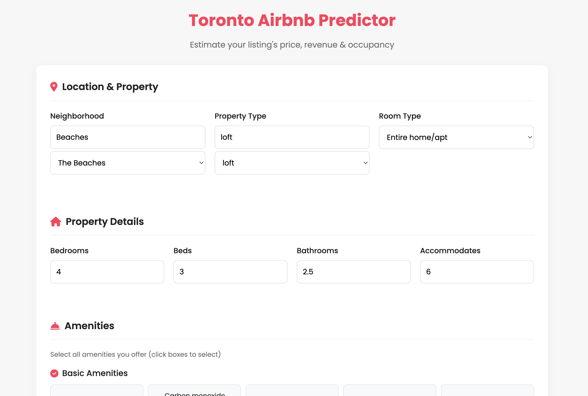
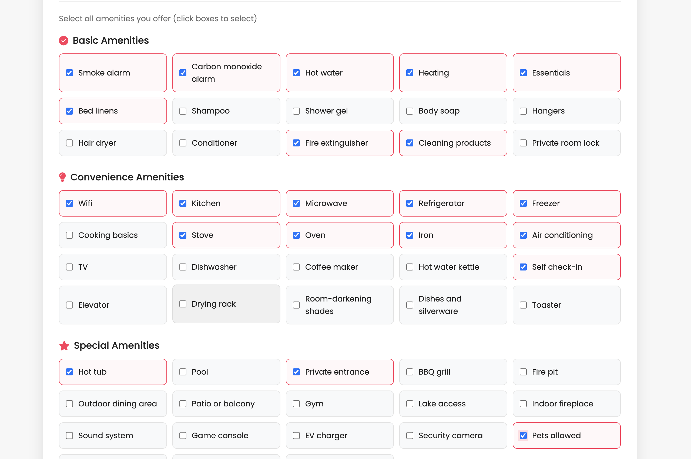
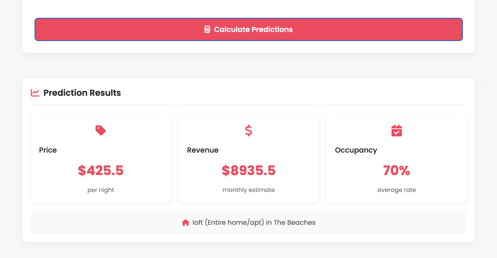
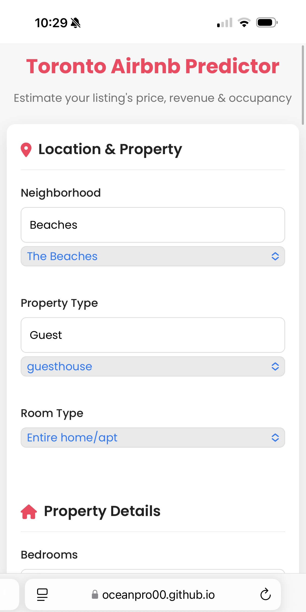
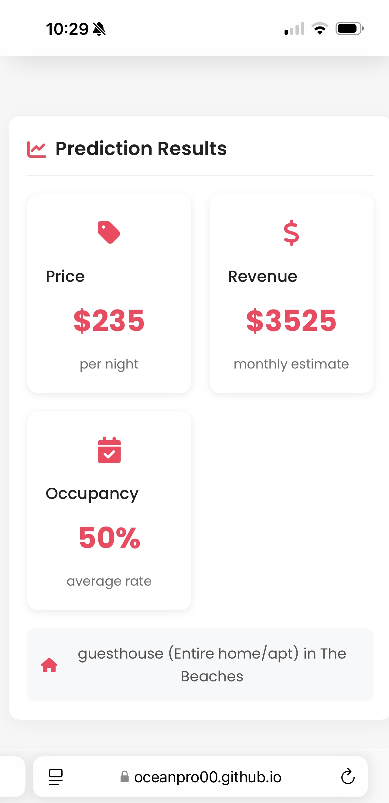

# Toronto AirBnB Pricing Assistant (TAPA)


## [Try the Live Demo](https://oceanpro00.github.io/toronto_airbnb_pricing_assistant/)

## Table of Contents
- [Project Overview](#project-overview)
- [Key Features](#key-features)
- [Data Sources](#data-sources)
- [Machine Learning Approach](#machine-learning-approach)
- [Project Implementation](#project-implementation)
- [Model Performance](#model-performance)
- [Process Notes](#process-notes)
- [Repository Structure](#repository-structure)
- [Frontend Interface](#frontend-interface)
- [Team Members](#team-members)
- [Data Attribution](#data-attribution)

## Project Overview

The **Toronto AirBnB Pricing Assistant (TAPA)** is a data-driven tool that helps AirBnB hosts and property investors optimize their rental pricing strategy in Toronto. By analyzing Inside AirBnB data and identifying key value drivers, this tool provides actionable insights on:

1. **Optimal pricing** based on property details and location
2. **Estimated monthly revenue** potential
3. **Expected occupancy rates** for Toronto short-term rentals

Our web-based interface allows users to input their property details and immediately receive pricing recommendations tailored to the Toronto market.

## Key Features

- **Price prediction** based on neighborhood, property characteristics, and amenities
- **Revenue estimation** showing potential monthly earnings
- **Occupancy rate forecasting** to help with booking strategy
- **Interactive web interface** accessible through GitHub Pages
- **Baseline pricing protection** to ensure recommendations remain market-competitive

## Data Sources

Our project initially explored multiple data sources from **[Inside AirBnB Toronto](https://insideairbnb.com/get-the-data/)** (March 2, 2025), but the final implementation focused on:

- **`listings.csv.gz`** - Property details, pricing, and features

We opted not to use:
- `calendar.csv.gz` - This contained forecasted availability rather than factual data, making it less suitable for ML training
- `reviews.csv.gz` - Utilizing this would have required sentiment analysis and NLP techniques beyond our project scope
- `neighbourhoods.geojson` - While useful for visualization, our standardized neighborhood columns provided sufficient location data for modeling

## Machine Learning Approach

Our pricing assistant uses an ensemble of XGBoost models to generate predictions:

| Prediction | ML Model | Performance |
|---------------|----------|--------|
| **Price** | XGBoost Regressor | R² = 73.25% |
| **Revenue** | XGBoost Regressor | R² = 72.74% |
| **Occupancy** | XGBoost Regressor | R² = 65.47% |

Each model was optimized through extensive hyperparameter tuning and feature engineering to maximize predictive accuracy.

### Model Details 

1. **Price Prediction Model**
   - **Input Features**: Property type, location, amenities, accommodations, etc.
   - **Output**: Recommended nightly price
   - **Hyperparameters**: `max_depth=10, n_estimators=1000, learning_rate=0.01, subsample=0.5`

2. **Revenue Prediction Model**
   - **Input Features**: Property characteristics + price
   - **Output**: Estimated monthly revenue
   - **Hyperparameters**: `max_depth=8, n_estimators=800, learning_rate=0.01, subsample=0.5`

3. **Occupancy Prediction Model**
   - **Input Features**: Property characteristics + price
   - **Output**: Expected occupancy percentage
   - **Hyperparameters**: `max_depth=6, n_estimators=1000, learning_rate=0.01, subsample=0.7`

### Baseline Pricing Protection

To ensure our recommendations remain market-competitive, we implemented a baseline pricing mechanism that establishes minimum price thresholds based on:

- Neighborhood averages
- Property type-specific pricing
- Room type considerations

This mechanism prevents our model from suggesting prices below realistic market minimums, especially for underrepresented property types in specific neighborhoods.

## Project Implementation

### Data Preparation

Our data preparation pipeline included:

1. **Property Type Cleaning**:
   - Maintained data variance while removing true outliers
   - Removed underrepresented categories (e.g., "Shared room" type with only ~12 instances)
   - Preserved detailed property type information to maximize XGBoost pattern recognition

2. **Amenity Processing**:
   - Extracted amenities from JSON arrays
   - Identified valuable/common amenities
   - Created binary feature matrix for model input

3. **Feature Engineering**:
   - Created interaction terms (e.g., bed_bath_interaction)
   - Applied logarithmic transformations to handle skewed data
   - Calculated distance metrics from downtown Toronto
   - Generated neighborhood frequency statistics

4. **Data Scaling**:
   - Applied StandardScaler to numerical features
   - One-hot encoded categorical variables

## Model Performance

Despite extensive optimization efforts, we observed the following:

- **XGBoost models** consistently outperformed Linear Regression and Random Forest approaches
- **R² scores** ranged from 65-73%, reflecting the inherent variability in short-term rental pricing
- **Feature importance analysis** showed neighborhood, property type, and bed/bath counts as the strongest predictors
- **Baseline pricing protection** helped improve recommendation quality, especially for edge cases

### Why not higher R² scores?

Short-term rental pricing is influenced by numerous factors beyond property characteristics, including:
- Seasonal demand fluctuations
- Special events and tourism patterns
- Host pricing strategies and promotional offers
- Subjective elements like decor quality and photography

Given these inherent limitations in the data, our models perform well at capturing the explainable variance in pricing.

## Process Notes

Our model development process went through several iterations:

1. **Initial Approach**: We started with Linear Regression models, which achieved R² scores of only 40-50% due to the complexity and variance in the data.

2. **Random Forest Exploration**: We then tried Random Forest models, which improved performance to around 60-65% R².

3. **XGBoost Implementation**: Finally, we pivoted to XGBoost, which required a different data cleaning approach to maximize data variance and allow the model to better map complex relationships. This approach yielded our best results with R² scores of 73-74%.

4. **Advanced Techniques**: We also attempted PCA (Principal Component Analysis) and SHAP (SHapley Additive exPlanations) techniques, but these surprisingly reduced model accuracy by a few percentage points despite the additional computational complexity.

5. **Baseline Pricing**: To address potential outliers and improve prediction robustness, we implemented a baseline pricing system using 10% less than the 10th percentile pricing for each property type within each neighborhood (when sufficient data was available) or across all property types as a fallback. This approach ensured a true lower bound that wouldn't unduly influence the ML predictions.

## Repository Structure

```
toronto_airbnb_pricing_assistant/
│
├── data/
│   ├── raw/                  # Original compressed datasets
│   └── processed/            # Cleaned and transformed datasets
│
├── notebooks/
│   ├── 1_data_cleaning.ipynb       # Data cleaning and initial processing
│   ├── 2_feature_extraction.ipynb  # Feature engineering and matrix creation
│   └── 3_modeling.ipynb            # XGBoost model development
│
├── results/
│   ├── baseline_pricing.json       # Baseline price protection values
│   ├── price_XGBmodel.json         # Serialized price prediction model
│   ├── revenue_XGBmodel.json       # Serialized revenue prediction model
│   └── occupancy_XGBmodel.json     # Serialized occupancy prediction model
│
├── docs/                     # Web interface files (GitHub Pages)
│   ├── index.html            # Web application main page
│   ├── script.js             # JavaScript functionality
│   └── style.css             # CSS styling
│
├── documentation/            # Project documentation
│
├── requirements.txt          # Python dependencies for pip
├── environment.yml           # Conda environment configuration
│
└── README.md                 # Project documentation
```

## Frontend Interface

Our application features a user-friendly web interface hosted on GitHub Pages. The interface connects to models stored in an Amazon S3 bucket, allowing users to:

**[Access the live application here](https://oceanpro00.github.io/toronto_airbnb_pricing_assistant/)**

1. **Input property details**:
   - Select neighborhood location
   - Specify property and room type
   - Set number of bedrooms, bathrooms, and accommodations
   - Choose from available amenities

2. **Receive predictions**:
   - Recommended nightly price
   - Estimated monthly revenue
   - Expected occupancy rate

### Screenshots

#### Desktop View


*The desktop interface allows users to input property details and select amenities*


*The amenities selection section lets users choose from various amenity categories*


*After submission, users receive detailed price, revenue, and occupancy predictions*

#### Mobile View


*The responsive mobile interface for entering property details*


*Prediction results optimized for mobile viewing*

## Installation and Setup

To run this project locally:

1. **Clone the repository**
   ```
   git clone https://github.com/your-username/toronto_airbnb_pricing_assistant.git
   cd toronto_airbnb_pricing_assistant
   ```

2. **Install required dependencies**
   
   Using pip:
   ```
   pip install -r requirements.txt
   ```
   
   Using conda (new environment):
   ```
   conda env create -f environment.yml
   conda activate airbnb-toronto
   ```
   
   Using conda (existing environment):
   ```
   # Install dependencies into your existing environment
   conda install -c conda-forge pandas numpy scikit-learn xgboost matplotlib seaborn shap jupyter
   # Or from the environment.yml file
   conda env update --name your-existing-env-name --file environment.yml
   ```

3. **Prepare data files**
   - Extract the compressed data files in the `data/raw/` directory:
     ```
     cd data/raw/
     gunzip listings.csv.gz
     ```
   - Alternatively, you can use Python's gzip library to read the compressed files directly in your notebooks

4. **Run notebooks in order**
   - First run `1_data_cleaning.ipynb`
   - Then run `2_feature_extraction.ipynb`
   - Finally run `3_modeling.ipynb`

5. **View the web interface**
   - Open `docs/index.html` in a web browser
   - For the full experience, deploy to GitHub Pages

### Required Libraries

Main dependencies include:
- pandas - For data manipulation and analysis
- numpy - For numerical operations
- scikit-learn - For preprocessing and model evaluation
- xgboost - For the XGBoost models
- matplotlib and seaborn - For visualization
- shap - For model explainability
- jupyter - For running notebooks

These are the core libraries needed to run the notebooks and reproduce the analysis. All are specified in the requirements.txt and environment.yml files with minimum version requirements.

## Team Members
- **Sean Schallberger**
- **Bryan Carney**
- **Jitesh Makan**

## Data Attribution

This project uses data from Inside AirBnB (https://insideairbnb.com/get-the-data/). Inside AirBnB is an independent, non-commercial set of tools and data that allows you to explore how Airbnb is being used in cities around the world.

The data is provided under a Creative Commons Attribution 4.0 International License (CC BY 4.0). According to this license:
- You are free to share and adapt the data for any purpose, even commercially
- You must give appropriate credit, provide a link to the license, and indicate if changes were made

For more information about the CC BY 4.0 license, please visit: https://creativecommons.org/licenses/by/4.0/

We have modified and processed the original data to create our machine learning models and applications.

---

*This project was created as part of the University of Toronto Data Analytics Bootcamp, 2025.*
